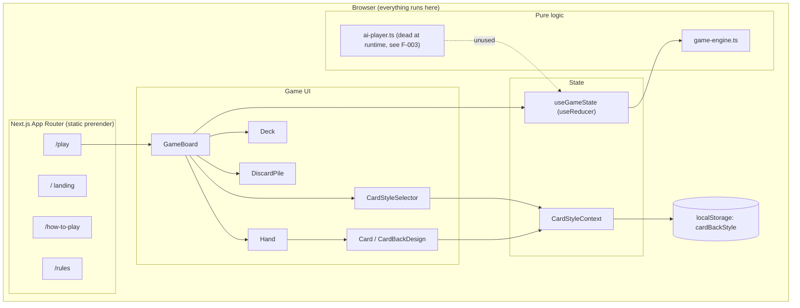
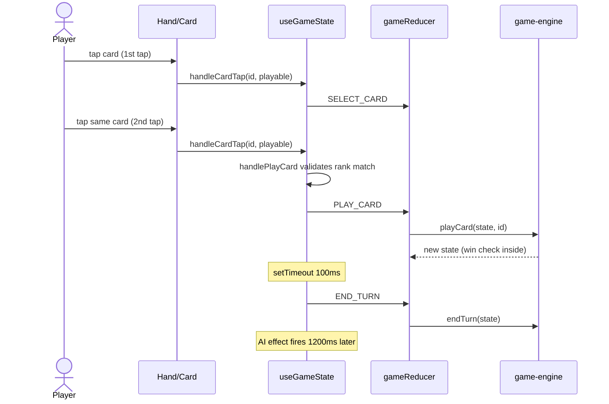
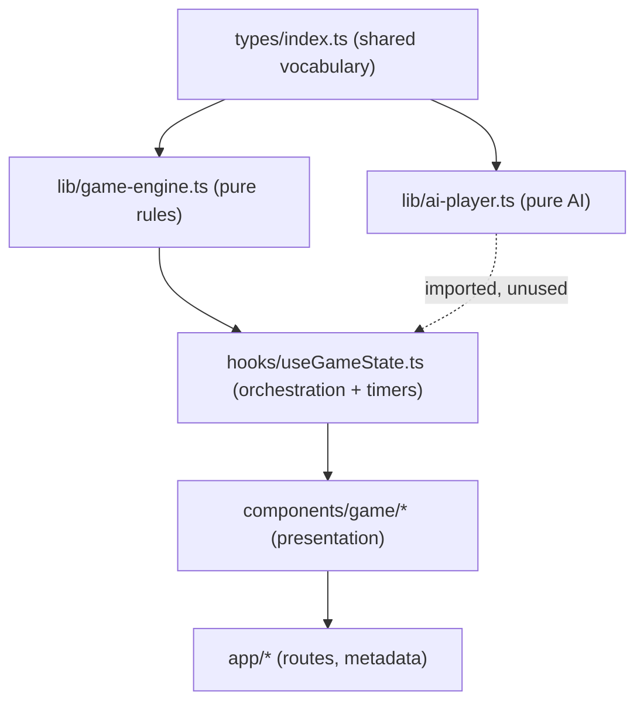

# Architecture, Third-Party Inventory, and Current Implementation

Single-page reference for how the system is laid out, what it talks to, and how the code is organized. For file-level detail see the repo-root index docs: `CODE_MAP.md`, `ENTRY_POINTS.md`, `DATA_FLOW.md`, `IMPORT_GRAPH_SUMMARY.md`, `FEATURE_BOUNDARIES.md`.

---

## 1. High-Level Architecture



**Key properties:**
- 100% client-side. No API routes, no server components with data fetching, no database, no network calls at runtime. All 5 routes prerender as static HTML (build VERIFIED).
- No auth model and no user identity; nothing to protect beyond a cosmetic preference.
- State: a single `useReducer` in `hooks/useGameState.ts` for the game, one Context for card-back style.
- Hosting model implied: any static-capable Next host (Vercel-style). No deploy config present in the repo.

---

## 2. Auth Flow

Not applicable. There is no authentication, no session, no token, and no user data. This is a deliberate property ("No account needed", `README.md`), not a gap.

---

## 3. Canonical Data Flow: human plays a card



**Notes:**
- Turn advancement is timer-driven from three separate call sites (100ms / 500ms / 300ms). See F-004 / BUG-005 for the race analysis.
- Playability is checked twice: in `GameBoard` (visual hints via `findPlayableCards`) and again in `handlePlayCard` and the engine. Redundant but harmless.

---

## 4. State / Module Layers



Layering is clean and one-directional; no circular dependencies. The two deviations are documented as findings: AI logic duplicated into the hook (F-003) and rule checks duplicated into GameBoard (cosmetic).

---

## 5. Third-Party Inventory

The runtime third-party surface is essentially zero.

### 5.1 Identity & Auth

None.

### 5.2 Backend / Application Data

None. No external service receives any data from this app.

### 5.3 Observability / Analytics

None. Notable as a gap relative to the SEO/traffic strategy in `CARD_GAME_MVP_PLAN.md` (see `product_strategy.md`).

### 5.4 UI / Presentation

| Package | Used for |
|---|---|
| react / react-dom 19 | Rendering |
| next 16 (Turbopack) | Routing, static generation, build |
| tailwindcss 3 + postcss + autoprefixer | Styling (build-time) |
| clsx | Conditional classes |
| Google Fonts (Inter via next/font) | Typography, self-hosted at build time by next/font |

### 5.5 Networking / Storage

| Mechanism | Used for |
|---|---|
| localStorage | Single key `cardBackStyle` (cosmetic preference, no PII) |

---

## 6. Current Implementation Walkthrough

### 6.1 Bootstrap & Routing

- `app/layout.tsx`: metadata (SEO-heavy), viewport (note F-011: zoom disabled), PWA meta, mounts `CardStyleProvider`. References a missing apple-touch-icon (F-007).
- Routes: `/` (animated landing), `/play` (game), `/how-to-play` and `/rules` (static SEO content pages).

### 6.2 Game domain

- `lib/game-engine.ts`: deck/shuffle/deal, rank-match rule, draw with auto-play-or-discard (classic Pitty Pat), reshuffle-on-empty (BUG-004 lives here), win detection, turn rotation.
- `hooks/useGameState.ts`: reducer wraps engine calls; two-tap mobile selection; hydration-safe init (placeholder state from `lib/initial-state.ts`, real game dealt post-mount); AI turn automation via effect timers (F-003, F-004).
- `lib/ai-player.ts`: difficulty-aware decision logic, currently unreachable from the UI path.

### 6.3 Presentation

- `components/game/GameBoard.tsx`: composition, score display, confetti on win, restart button, collapsible help.
- `Hand`/`Card`/`Deck`/`DiscardPile`: presentational; `Card` consults `CardStyleContext` for back designs.

### 6.4 Shared / Infrastructure

- `lib/debug-helper.ts`: dev-only, client-only console logging (correctly gated, F-012).
- `tailwind.config.ts` + `app/globals.css`: custom palette, felt/playful background, card animations.

---

## 7. Platform Verification Plan

Everything material was verified in this pass (Windows, Node, npm). Remaining items for a future pass:

### 7.1 Runtime smoke test

```bash
npm run build && npm run start
# visit /, /play, /how-to-play, /rules
# play a full round vs the AI; play until deck exhaustion to reproduce BUG-004
```

Expected: round completes; BUG-004 reproduces when the 42-card stock empties before anyone wins.

### 7.2 Lighthouse / PWA

```bash
npx lighthouse http://localhost:3000 --only-categories=pwa,accessibility,seo
```

Expected: PWA icon failures (F-007) and zoom-disabled accessibility flag (F-011) until fixed.

---

## 8. Open Verification Queue

| Item | Needs | Owner |
|---|---|---|
| Reproduce BUG-004 (deck exhaustion) in a live session | Long round or a seeded deck in a test | Developer |
| Reproduce BUG-005 timing race | Unit test with fake timers | Developer |
| Lighthouse PWA/accessibility run | Local server | Developer |

---
generated_by: codebase-audit skill v1.0
generated_on: 2026-06-10
project: C:\Users\Perry\Dropbox\PC\Documents\GitHub\Pitty_Pat
project_type: node
verification: full
---
